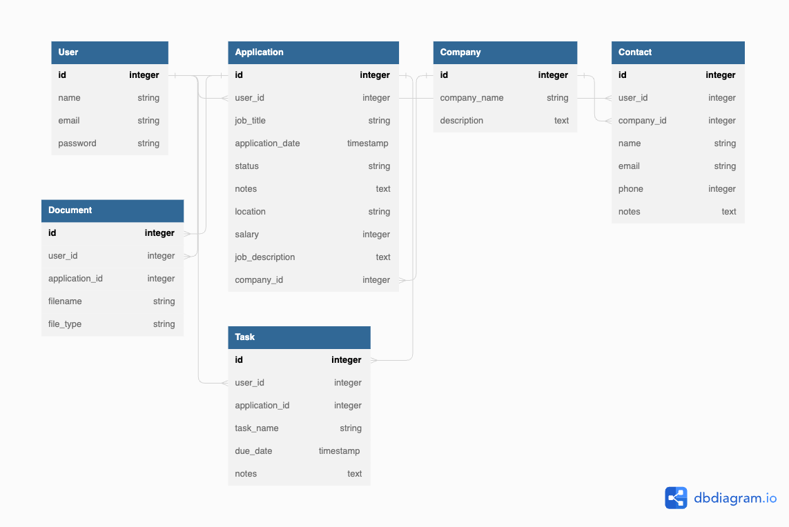

# AppliQuest
AppliQuest is a job application tracker web app that helps job seekers organize and manage their job applications in one place.

## 1 Goal 
The primary goal of the Job Application Tracker website is to provide a centralized location for job seekers to manage all aspects of their job search. The website will allow job seekers to keep track of their job applications, organize their job search, and keep all their job search details in one place.

## 2 Users 
The website will be designed for job seekers of all ages and backgrounds who are actively looking for employment. The primary demographic of users will be individuals who are seeking full-time or part-time employment opportunities, including recent graduates, professionals, and individuals who are looking to change careers.

## 3 Data 
The website will use job application data such as the company name, job title, application date, status updates, contact details, notes, tasks, documents, job descriptions, salaries, locations, and company data. The data will be collected from job boards and user input, and it will be securely stored in a database.

## 4 Approach
   
### 4.1 Database schema

The database schema will consist of tables for users, job applications, companies, job descriptions, and other relevant data. The relationships between the tables will be established to ensure data integrity and efficient querying.

|User| |
|-|-|
|id|unique identifier for each user|
|name |name of the user|
|username| username chosen by user|
|email|email address of the user|
|password|hashed password for user authentication|

|Application| |
|-----------|--|
|id| unique identifier for each job application|
|user_id|foreign key to the users table|
|company_id|foreign key to the companies table|
|job_title|title of the job|
|post_url| link to the job posting|
|application _date|date when the application was submitted|
|status|status of the application (e.g. applied, interview scheduled, rejected)|
|notes|any notes or comments about the application|
|location|location of the job|
|salary|salary range for the job|
|job_description|full job description for the job|

|Company |  |
|-|-|
|id| unique identifier for each job application|
|company_name| name of the company|
|location| company location|
|company_url| link to the company websit|
|description| about the company|

|Contact| |
|-------|--|
|id|unique identifier for each contact|
|user_id|foreign key to the users table|
|company_id|foreign key to the companies table|
|name|name of the contact person at the company|
|email|email address of the contact person|
|phone|phone number of the contact person|
|notes|any notes or comments about the contact|

|Document| |
|-|-|
|id|unique identifier for each document|
|user_id|foreign key to the users table|
|application_id|foreign key to the applications table|
|title|name of the file|
|category|type of the file (e.g. resume, cover letter, transcript)|
|file_url|URL to access the file|

|Task| |
|-|-|
|id|unique identifier for each task|
|user_id|foreign key to the users table|
|application_id|foreign key to the applications table|
|task_name|name of the task|
|due_date|due date for the task|
|notes|any notes or comments about the task|

### 4.2 API Issues
One potential issue that may arise with the API is the availability and accuracy of the job data. The website will use job board APIs and web scraping techniques to gather job data, which may not always be up-to-date or complete.

### 4.3 Sensitive information
Sensitive information such as user login credentials, personal information, and job application details will be securely stored and encrypted.

### 4.4 Functionality 
The website will include features such as user registration and login, job application tracking, job search organization, document storage, and notes and task management.

### 4.5 User flow
The user flow will begin with the user registration and login process. Once logged in, the user will be directed to their personalized dashboard, where they can add and manage their job applications, organize their job search, and track their progress. The website will also provide additional resources and job search tips to help users navigate the job search process.

### 4.4 Features
#### 4.4.1 Job application tracking: 
Users will be able to track the status of their job applications, including the date of application, application status, interview dates, and other relevant details. They will also be able to set reminders and receive notifications for upcoming interview dates.

#### 4.4.2 Document storage: 
Users will be able to upload and store resumes, cover letters, and other documents related to their job applications. This will allow them to quickly access these documents when needed, such as when updating an application or preparing for an interview.

#### 4.4.3 Task management: 
Users will be able to create and manage tasks related to their job search, such as networking events to attend, job fairs to visit, and follow-up calls to make.

#### 4.4.4 Analytics and reporting: 
Users could view analytics and reports on their job search progress, including the number of applications submitted, the number of interviews secured, and the success rate of their job search.

### 4.5 Potential features that could be added in the future include:
#### 4.5.1 Company research: 
The website will allow users to research companies they are interested in, including details such as the company's mission, culture, and reviews from current and former employees.

#### 4.5.2 Integration with job search engines: 
The website could integrate with job search engines like Indeed or Glassdoor to provide users with even more job search opportunities and data.

#### 4.5.3 Matching algorithm: 
A matching algorithm could be developed to match job seekers with job openings that fit their skills and qualifications.

